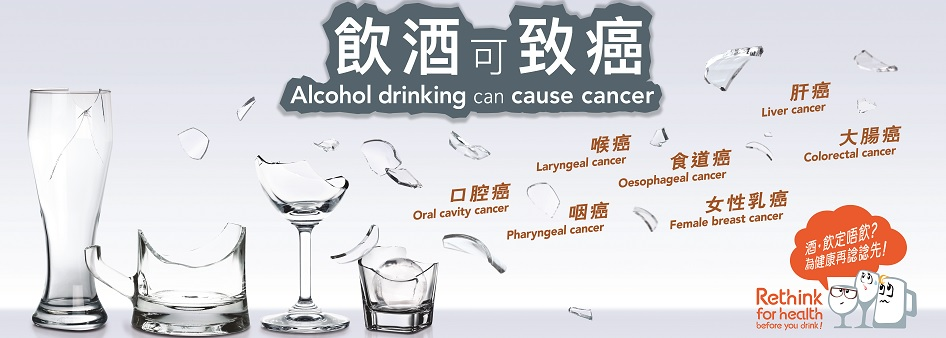

# 🍸 Bars

> Author: Patrick Star

> [!CAUTION]
> Excessive drinking is harmful to your health. People should know their limits, and alcohol should be consumed in moderation. Non-drinkers should not start drinking for the perceived health benefits of alcohol consumption.

## lost (now known as bar HEYGANBAYTON) *5 / 10 points*

::: info Business Hours / Address
18:30-03:00 | No. 2013, Jintong Road, Xiangzhou District, Zhuhai
:::

Lost enjoys a prime location directly opposite the school name stone, but its hardware and software facilities are fairly average. It’s suitable for satisfying a craving for alcohol or casually having some spirits.

First, the quality of the drinks and the service are the key standards for judging whether a bar is worth visiting. Lost has no bartenders capable of mixing cocktails, and the base liquors used are of mediocre quality with a very low cost-performance ratio. Secondly, the keg packages sold in Lost are not exactly cheap—around 200 RMB per keg. Buying juice and base liquor separately at the counter is even more expensive, making it better to mix your own drinks in the dorm.

The food at Lost, although pre-made, is acceptable in quality. However, the chef leaves after 2 a.m. That said, Lost closes very late and will even let you drink until six or seven in the morning, allowing you to sit outside the bar and continue drinking.

## Sili Craft Beer Bar (肆礼精酿酒吧) *7 / 10 points*

::: info Business Hours / Address
No. 1, Huitong Third Alley, Xiangzhou District, Zhuhai
:::

Previously run by two male students from BIT, it was taken over in April 2025 by BNBU students (the handover was simply due to both original owners needing to start internships). It’s relatively close, located in Huitong Village near BNBU.

Since the author only drank here before the handover, no comments will be made about the current drink quality.

The bar is located in a heritage-protected building, with tasteful décor. Compared to the dark Lost, it has a livelier vibe.

It also offers private rooms, large tables, and poker games, so you can enjoy a craft beer and a round of Texas Hold’em with friends.

## 9 sqm (9平米) *7 / 10 points*

::: info Business Hours / Address
Beijing Institute of Technology (Zhuhai), Jintang Road, Xiangzhou District, Zhuhai
:::

Also run by BIT students, this bar is larger in scale. As of May 2025, when the author last visited, there were already two operating locations. It is named "9 sqm" because the original venue was only 9 square meters in size. The bar is not far—only a 15-minute taxi ride away.

As a cocktail-focused lounge bar, it has excellent value for money. Average drinks cost between 40-60 RMB. Coming with friends to this small town near the university town is a nice way to relax. The décor leans towards casual home style, and you can also go up to the rooftop terrace for a drink. There is basically no food, so it’s recommended to bring your own late-night snacks.

## Typhoon Tavern - Kiln Pizza (台风酒馆-窑炉披萨) *9 / 10 points*

::: info Business Hours / Address
11:00-01:00 | No. 6-101, Tangren Street, Tangle Road, Tangjiawan, Xiangzhou District, Zhuhai
:::

An old establishment in Zhuhai for over ten years, specializing in handmade pizza and craft beer. It’s slightly farther than the above three bars, about a 20-minute taxi ride away.

The craft beer selection is vast, from white peach sweet ale to classic IPA to salty-sweet preserved plum beer—over a dozen flavors. Probably only HEY!GO can compete in variety. The kitchen has no partitions, so you can observe the pizza-making process up close. While not cheap, the taste fully justifies the price.

The overall design is modern, with posters, artwork, decorations, and even the tavern’s logo all commissioned at significant cost by the landlady (learned during a friendly chat with her).

## HEY!GO *8 / 10 points*

::: info Business Hours / Address
18:00-02:00 | Room 7-1, No. 7 Nanpaifang Street, Xiangzhou District, Zhuhai
:::

A well-known craft beer bar in Zhuhai. It’s far from BNBU (about 40 minutes by taxi) but close to Huafa Mall (only 10 minutes on foot). Named after the large black dog kept inside.

The craft beer rotates every one to two weeks, all carefully selected and tasted by the owner. There is always something for everyone. The bar also has a projector for movie screenings, and the overall ambiance is dim.

## 3000 ANTIQUE *9 / 10 points*

::: info Business Hours / Address
10:00-02:00 | Basement Mall, No. 56 Jingxin 2nd Street, Xiangzhou District, Zhuhai (inside 3000 ANTIQUE HOUSE)
:::

A must-visit cocktail bar for vintage lovers, though far from BNBU (about 40 minutes by taxi). A "day café, night bar" type of venue, with occasional live band performances.

The interior is very luxurious, with all furniture being antiques—perfect for taking photos! The cocktails are well-made, and although the prices (70-100 RMB per drink) are higher than most bars, they are worth every penny.

## HILL COCKTAIL *9 / 10 points*

::: info Business Hours / Address
19:00-02:00 | 19th Floor, Yijingwan Hotel, No. 47 Qinglv Middle Road, Xiangzhou District, Zhuhai
:::

The 9 out of 10 rating is not because of the bar itself, but because of the author’s own financial limitations QwQ. If you want to experience a classic jazz cocktail bar, this is the place. It’s remote—about 45 minutes by taxi.

Located on the upper floors of a hotel, the balcony view is spectacular, and the interior design is loaded with European retro style. The clientele is diverse—the author has seen cigar aficionados come here just to enjoy a Cuban cigar alone, and wealthy patrons spend lavishly on a single bottle.

## YDM Yi Di Miao Herbal Tea (YDM医帝庙凉茶) *9 / 10 points*

::: info Business Hours / Address
19:00-02:00 | No. 78-5, Beishan Zhengjie, Beishan Village, Zhuhai
:::

Its location is very close to HEY!GO, and similarly about 40 minutes by taxi.

This bar is also renovated from a heritage building and offers cocktails infused with Chinese tea culture—a rarity in China!

During the day it sells regular tea (though pricey), but the real deal is the cocktails served at night.

The environment is full of classic Chinese charm, and the atmosphere of Beishan Courtyard adds to YDM’s tea fragrance.

## Epilogue

In addition, the author has visited many other bars, such as Zaojiu （造久） (an old cocktail bar brand whose former bartenders can be found in Shanghai and Fuzhou) and Deal Cocktail (a perfect spot for photoshoots, where the author also filmed with a crew). Drink-loving veterans are welcome to add and correct this list.
