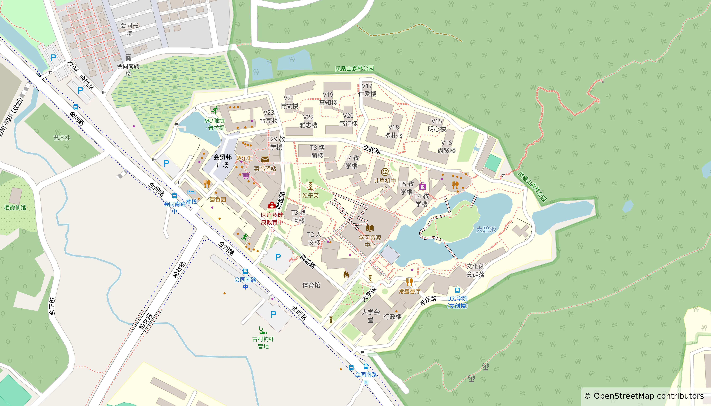

# 前言

欢迎使用 BNBU 手册！

本企划将为 BNBUer 提供快捷信息查询服务。

在这里你可以获取 BNBU 的绝大部分资讯，同时这也是前人所留下有价值的信息遗产，有助你在未来四年的本科生涯中弯道超车 。

## 🗺️ 校园地图

* 一期校园

* 二期校园

## ✍️ 加入协作

本手册采用协作编辑制度，这代表着您可以加入企划并参与条目的编辑。

### ⌨️ 具有编程基础

在每一页的页尾处，您可以发现写有“参与编辑”的超链接，点击链接即可以跳转到 GitHub 项目对应的文件处，请 Fork 至自有仓库后进行修改，编辑完成后提出 Contribute 请求，经审查后等待 Merge 完成。

* 快速上手（推荐）
本项目已使用 Actions 自动推送页面，因此您可以直接 Fork main分支，然后对特定的 Markdown 文件进行修改即可。

* 完全配置
请参照 package.json 与 workflows 下的 .yml 文件进行环境配置，这样您可以本地参照完修改后的效果再进行 Contribute。有关于本项目的更多信息请浏览“关于”栏目。

### 🔰 我是新手

* 在 GitHub 上
即便是电脑新手亦可以加入任何一个条目的编辑，在本页的末尾处，我们提供了本项目的地址，请在 Discussions 区与 Issue 区参与讨论或提出问题。

* 联系企划组
BNBU 手册企划建有官方聊天群，您可以选择进入并与包括企划负责人在内的其他同好进行沟通与交流。

| 平台 | 加入链接 | 备注 |
|-----|-----|-----|
| QQ | 728748053 | 对昵称有实名要求 |

## 许可

本项目源码托管于 GitHub，页面托管于 GitHub Page，源码采用 [MIT 开源许可](https://mit-license.org/)。

全站知识资源未做特别声明，均采用 [CC-BY-NC-SA 4.0](https://creativecommons.org/licenses/by-nc-sa/4.0/) 协议进行分发。

 

